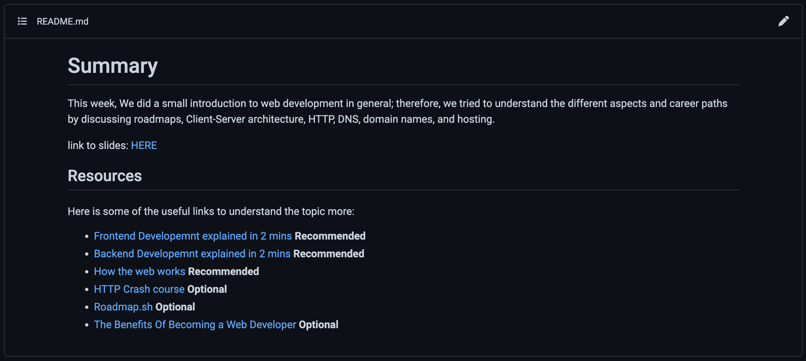

# Second week challenge 🤖

Hi folks,
In the last session, we learned the basics of HTML and CSS 🧑🏻‍💻
Now it's the time to get your hands dirty and try to build real stuff.

## Challenge tasks 📝

Here are the list of tasks to deliver for this challenge:

### First, replicate the readme.md file from the week 01

Try to create a new html file and build a page with the same content as the README.md file from week 01



### Second, create the folder week_02/_data/YOUR-USERNAME/

Fork this repository, create a new folder inside the `week_02/_data` folder, and name it with your username. It should look something like this `_data/<YOUR-USERNAME>/`. Ex.
```
week_02/_data/Neoxs/index.html
```
Copy your response into the file

### Third, submit your Pull Request

Go through the checklist on the pull request template to guarantee your submission is valid. we will review your submission, approve and merge it if everything is correct. Otherwise, you will get notified of the changes requested in the pull request comment section. 

### Finally, Share your progress with us 👩‍🏫👨‍🏫

Finally go back to our discord channel and reply with challenge done ✅